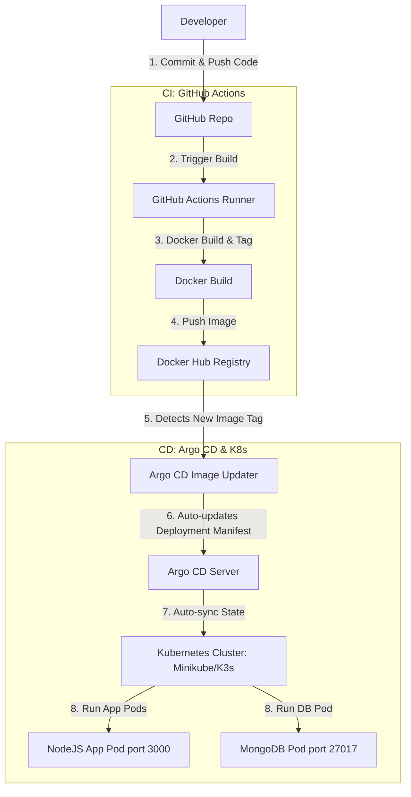
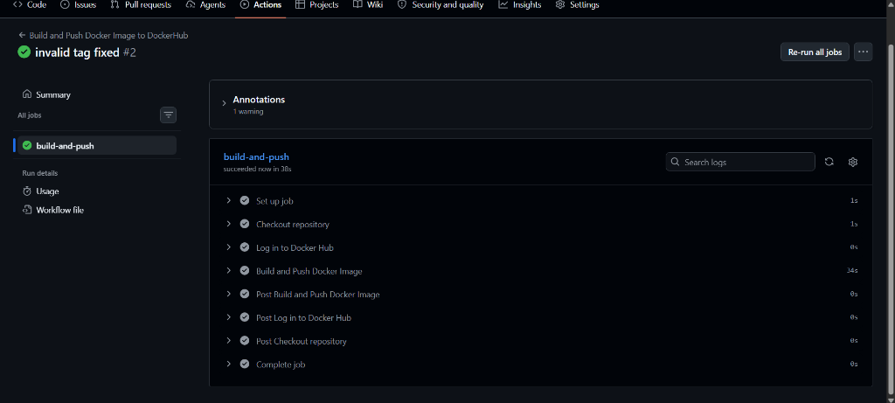

# Online Shopping Application

This application was built using [Node.js 14](https://nodejs.org/en/), [Express](https://expressjs.com/), [EJS Template Engine](https://ejs.co/), [Stripe](https://stripe.com/fr), [PDFKit](https://pdfkit.org/), [Mongoose ORM](https://mongoosejs.com/) and [MongoDB](https://www.mongodb.com/) for persistence. It consists on an online shopping application.

**The application was deployed on AWS Beanstalk, to access it, click [here](http://nodeshopping-env.eba-czedjv9y.eu-west-2.elasticbeanstalk.com/).**

## Running Application Process on your computer

1. Download the application by Clicking [this link](https://github.com/gaetanBloch/nodejs-shopping/archive/master.zip)
2. Unzip the application
3. Download and Install [node.js](https://nodejs.org/en/download/) 
4. Open a terminal
5. Move to the root of the application
6. Run `npm install`
7. Run `npm start`
8. Visit the website http://localhost:3000/ on your favourite browser

## Application

### Signup


### Login


### Reset Password


### Shopping List


### Shopping List Pagination


### Responsive Shopping List


### Add Product


### Shopping List Admin


### Edit Product


### Cart Summary


### Cart Checkout


### Order Payment


### Passed Orders Summary


### Order invoice


---

## DevOps & GitOps Architecture (ArgoCD & Kubernetes)

### 1. Application Architecture Analysis
* **Tier Architecture**: **2-Tier Monolithic Application**
  * **Frontend & Backend (Tier 1)**: Built as a single Express.js application serving dynamic EJS views (Server-Side Rendering) combined with backend API routing and business logic.
    * **Port**: **`3000`** (runs by default on port 3000, customizable via `PORT` environment variable).
  * **Database (Tier 2)**: Uses **MongoDB** for persistence and session management.
    * **Port**: **`27017`** (default MongoDB port).

### 2. DevOps & GitOps End-to-End Workflow Flow
The diagram below illustrates the general workflow of the automated GitOps pipeline:



---

### 3. Step-by-Step DevOps Implementation Guide

This project is prepared for DevOps integration. Below is the blueprint of files and steps to implement the GitOps workflow.

#### Step 1: Dockerize the Application
The Docker configurations are located in the `Dockerfiles/` directory.

**`Dockerfiles/Dockerfile`:**
```dockerfile
FROM node:alpine AS builder
WORKDIR /usr/src/app
COPY package*.json ./
RUN npm ci --only=production

FROM node:alpine
WORKDIR /usr/src/app
COPY --from=builder /usr/src/app/node_modules ./node_modules
COPY . .
RUN mkdir -p images
EXPOSE 3000
ENV PORT=3000
CMD ["node","app.js"]
```

**`Dockerfiles/.dockerignore`:**
```text
node_modules
npm-debug.log
.git
.github
Dockerfile
.dockerignore
```

To build this Docker image locally from the project root directory, run:
```bash
docker build -t your-dockerhub-username/nodejs-shopping:latest -f Dockerfiles/Dockerfile ./Dockerfiles
```

#### Step 1.1: Local Testing with Docker Compose
To test the entire multi-container setup (Node.js app + MongoDB database) locally on your system:

**Run the stack:**
```bash
docker-compose up -d --build
```
This command will build the frontend/backend application, download the MongoDB image, set up the database authentication credentials, configure shared storage volumes, and start both containers in a bridge network.
* **App URL**: [http://localhost:3000](http://localhost:3000)
* **Database Port**: `27017`

**Stop the stack:**
```bash
docker-compose down -v
```
*(The `-v` flag removes the database volume if you want to perform a clean reset).*

#### Step 2: Write Kubernetes Manifests
Create a `k8s/` folder in the root of your repo to hold the Kubernetes resources:
* **MongoDB Manifests (`k8s/mongodb.yaml`)**:
  * Create a `Deployment` running image `mongo:4.4` and exposing port `27017`.
  * Create a `ClusterIP` `Service` named `mongodb-service` pointing to port `27017`.
  * Create a `PersistentVolumeClaim` (PVC) for persistent database storage.
* **App Manifests (`k8s/app.yaml`)**:
  * Create a `Deployment` running your custom image (e.g. `your-dockerhub-username/nodejs-shopping:latest`) and exposing container port `3000`.
  * Inject database credentials via Environment Variables (`MONGO_USER`, `MONGO_PWD`, `MONGO_DB`) pointing to a Kubernetes `Secret`/`ConfigMap`.
  * Create a `LoadBalancer` or `NodePort` `Service` (or `Ingress`) pointing to port `3000` to expose the UI.
* **Secrets & ConfigMaps (`k8s/config.yaml`)**:
  * Store credentials safely using Kubernetes Secrets.

#### Step 3: Implement Continuous Integration (CI) with GitHub Actions
The workflow is defined at [ci.yaml](file:///.github/workflows/ci.yaml):

```yaml
name: Build and Push Docker Image to DockerHub

on:
  push:
    branches:
      - main

jobs:
  build-and-push:
    runs-on: ubuntu-latest
    steps:
      - name: Checkout repository
        uses: actions/checkout@v3

      - name: Log in to Docker Hub
        uses: docker/login-action@v2
        with:
          username: ${{ vars.DOCKER_USERNAME }}
          password: ${{ secrets.DOCKER_PASSWORD }}

      - name: Build and Push Docker Image
        uses: docker/build-push-action@v4
        with:
          context: ./Dockerfiles
          file: ./Dockerfiles/Dockerfile
          push: true
          tags: |
            ${{ vars.DOCKER_USERNAME }}/nodejs-cicd-shopping:latest
            ${{ vars.DOCKER_USERNAME }}/nodejs-cicd-shopping:${{ github.sha }}
```

##### CI Pipeline In Action:
Here is a screenshot of the successful GitHub Actions run building and pushing the Docker image:



*Note: Make sure to add `DOCKER_USERNAME` as a Repository Variable and `DOCKER_PASSWORD` as a Secret under your GitHub Repository Settings (Settings -> Secrets and variables -> Actions).*

#### Step 4: Install and Configure Argo CD (CD)
1. **Install Argo CD** on your K3s/Minikube cluster:
   ```bash
   kubectl create namespace argocd
   kubectl apply -n argocd -f https://raw.githubusercontent.com/argoproj/argo-cd/stable/manifests/install.yaml
   ```
2. **Access Argo CD API Server**:
   Expose the service via Port-Forwarding:
   ```bash
   kubectl port-forward svc/argocd-server -n argocd 8080:443
   ```
3. **Register Git Repository & Create ArgoCD App**:
   Define an Argo CD Application pointing to your GitHub repo and target the `k8s/` folder path. Enable **Auto-Sync** and **Prune Resources** options.

#### Step 5: Integrate Argo CD Image Updater
1. **Install Argo CD Image Updater**:
   ```bash
   kubectl apply -n argocd -f https://raw.githubusercontent.com/argoproj-labs/argocd-image-updater/stable/manifests/install.yaml
   ```
2. **Annotate your Argo CD Application** to enable image tracking:
   ```yaml
   metadata:
     annotations:
       argocd-image-updater.argoproj.io/write-back-method: git
       argocd-image-updater.argoproj.io/image-list: my-app=your-dockerhub-username/nodejs-shopping
       argocd-image-updater.argoproj.io/my-app.update-strategy: latest
   ```
   *Note: Using the `git` write-back method, Argo CD Image Updater will push a commit with the new image tag directly to your git repository (into a `.argocd-source.yaml` file), automating the entire GitOps lifecycle.*

