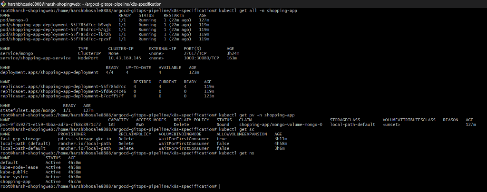
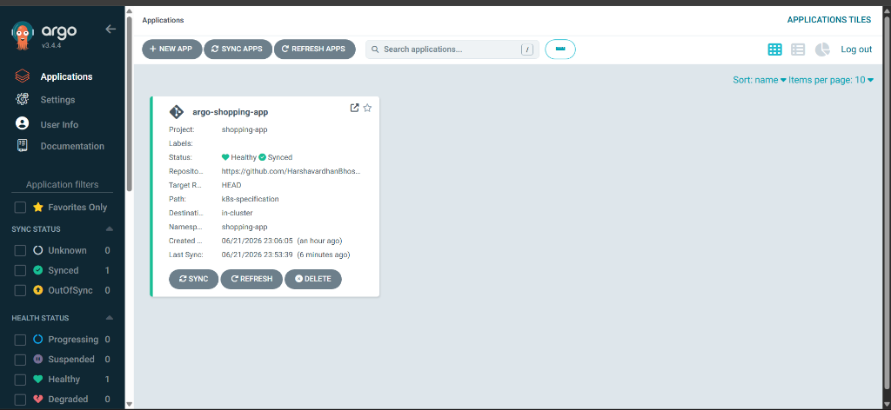
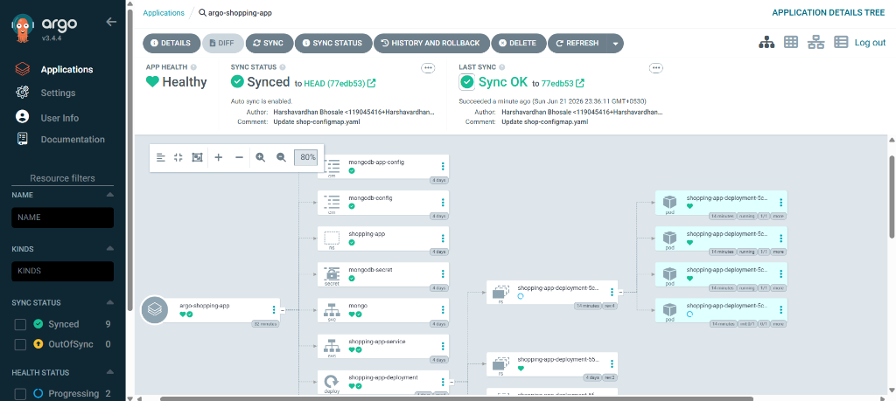
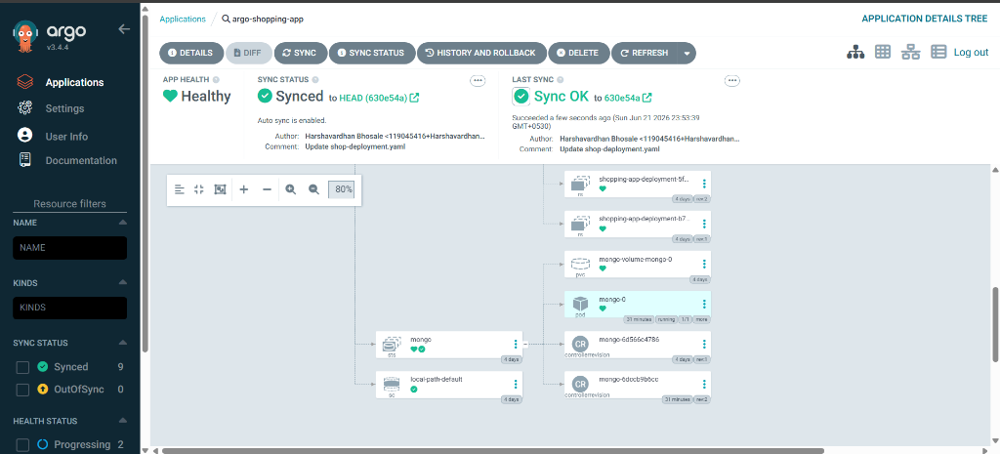

# ArgoCD GitOps Pipeline (argocd-gitops-pipeline)

[](https://github.com/HarshavardhanBhosale/argocd-gitops-pipeline/actions)
[](https://kubernetes.io)
[](https://argoproj.github.io/argo-cd/)

This repository implements an automated end-to-end GitOps continuous delivery pipeline. It containerizes a multi-tier Node.js online shopping application and deploys it dynamically to a Kubernetes cluster using GitHub Actions for Continuous Integration (CI) and Argo CD coupled with Argo CD Image Updater for Continuous Deployment (CD).

---

## 1. System Architecture & Component Analysis

The application is architected as a highly available, containerized **2-Tier Monolithic System**:

* **Presentation & Application Layer (Tier 1)**: 
  * Built using **Node.js 14**, **Express**, and the **EJS Template Engine** for Server-Side Rendering (SSR).
  * Exposes the web interface and handles routing, authentication, dynamic invoice generation (via PDFKit), and payment processing integrations (Stripe).
  * **Network Port**: Configured to run on container port **`3000`** (customizable via `PORT` environment variable).
* **Data Persistence Layer (Tier 2)**: 
  * Uses **MongoDB** and **Mongoose ORM** to store user information, session data, and catalog products.
  * **Network Port**: Communicates on port **`27017`**.

---

## 2. CI/CD & GitOps Workflow

The deployment state is managed entirely through Git. Whenever a change is committed, the following automated pipeline executes:


---

## 3. Infrastructure as Code (IaC) & Orchestration

The project provides configurations to launch the stack locally or deploy it to a production Kubernetes environment.

### Local Development Orchestration (Docker Compose)
A multi-container Docker Compose environment is defined in [docker-compose.yaml](file:///docker-compose.yaml) to run the system locally for development and testing.

```bash
# Start the entire stack in detached mode
docker-compose up -d --build

# Stop the stack and purge data volumes
docker-compose down -v
```

### Production Deployment Manifests (`k8s-specification/`)
The Kubernetes manifests inside the [k8s-specification](file:///k8s-specification/) folder define the production environment:

1. **Dedicated Namespace (`namespace.yaml`)**: Places all resources inside the isolated `shopping-app` namespace.
2. **Storage Provisioning (`local-storageclass.yaml` & `setup-storage.sh`)**:
   * Defines a default `StorageClass` named `local-path-default` mapped to the Rancher local-path provisioner for dynamic volume binding.
   * Includes a helper shell script `setup-storage.sh` designed to be executed on the host node with `sudo` permissions. It initializes the `/opt/local-path-provisioner` directory structure and grants full read/write permissions (`chmod 777`) to avoid file access errors or locks when MongoDB mounts its storage volume.
3. **Database StatefulSet (`mongo-statefullset.yaml`, `mongo-headless-svc.yaml`)**:
   * Uses a **StatefulSet** instead of a Deployment to ensure stable network identifiers and persistent database storage volume claims (`1Gi`).
   * Configured with Argo CD **Sync Wave 1** to guarantee that the database starts before the application container initialization begins.
4. **App Service Deployment (`shop-deployment.yaml`, `shop-service.yaml`)**:
   * Runs **4 replicas** of the application for high availability.
   * Includes a **`initContainer`** (`wait-for-mongo`) that polls the MongoDB service, delaying application startup until the database is fully responsive.
   * Configured with Argo CD **Sync Wave 2** to run only after the database sync wave completes.
   * Exposes the web interface on port **`30080`** using a NodePort service.

#### Cluster Status Verification
```bash
kubectl get all -n shopping-app
```


---

## 4. Pipeline Configurations

### Continuous Integration (GitHub Actions)
The CI pipeline is defined at [.github/workflows/ci.yaml](file:///.github/workflows/ci.yaml). On every push to `main`, it logs into Docker Hub, builds the container using a multi-stage `Dockerfile`, and pushes the release image tagged with both `:latest` and the Git commit SHA.

```yaml
# Configuration snippet from ci.yaml
      - name: Build and Push Docker Image
        uses: docker/build-push-action@v4
        with:
          context: ./Dockerfiles
          file: ./Dockerfiles/Dockerfile
          push: true
          tags: |
            ${{ vars.DOCKER_USERNAME }}/nodejs-cicd-shopping:latest
            ${{ vars.DOCKER_USERNAME }}/nodejs-cicd-shopping:${{ github.sha }}
```

#### CI Run Proof


### Continuous Deployment & GitOps (Argo CD)

#### 1. Argo CD Installation
```bash
kubectl create namespace argocd
kubectl apply -n argocd -f https://raw.githubusercontent.com/argoproj/argo-cd/stable/manifests/install.yaml
```

#### 2. Auto-Deployment & Promotion Configuration
To enable the **Argo CD Image Updater** to automatically sync updates without manual manifest changes, annotate your Argo CD Application configuration:

```yaml
metadata:
  name: shopping-app
  namespace: argocd
  annotations:
    # Write updates back to Git repository
    argocd-image-updater.argoproj.io/write-back-method: git
    # Target Docker image path
    argocd-image-updater.argoproj.io/image-list: my-app=harshavardhan88/nodejs-cicd-shopping
    # Update strategy (latest, semver, or digest)
    argocd-image-updater.argoproj.io/my-app.update-strategy: latest
```

#### 3. Argo CD Application Live Synchronization Status
Below is the status of the `argo-shopping-app` dashboard in Argo CD. The application is marked as **Synced** and **Healthy**, deploying the configured Kubernetes resources (Services, Deployment replicas, Configuration Maps, Secrets, and StatefulSet structures) seamlessly to the cluster:

##### Argo CD Applications Dashboard:


##### Resource Sync Tree Details:
| Application Resources & Sync Status | StatefulSet & PV Deployment Tree |
|---|---|
|  |  |

---

## 5. Application Features Gallery

Here is a visual overview of the operational frontend interface:

| Signup | Login |
|---|---|
||  |

| Shopping List Catalog | Responsive UI View |
|---|---|
|  |  |

| Cart Summary | Checkout & Payment |
|---|---|
|  |  |
